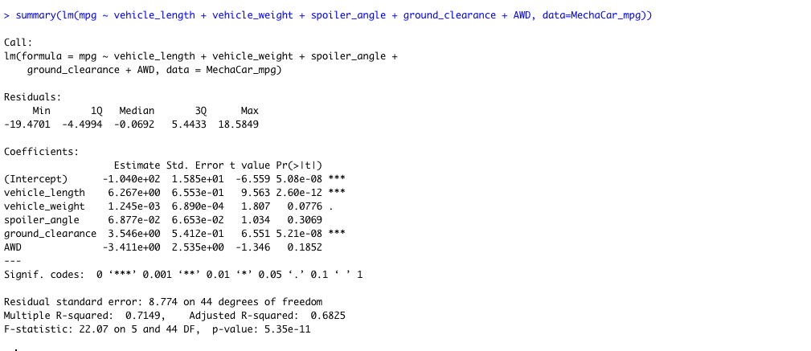
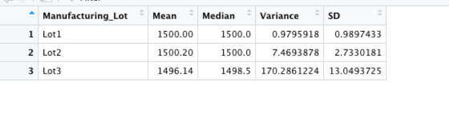
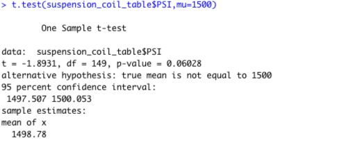
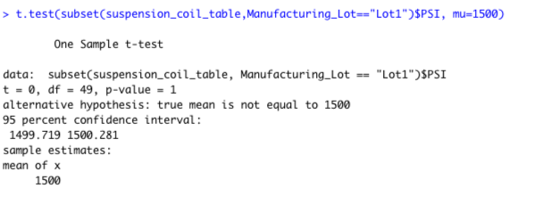
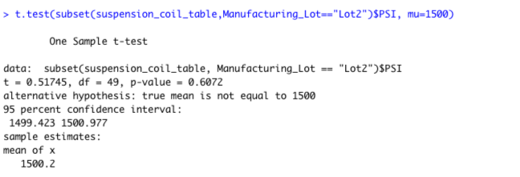
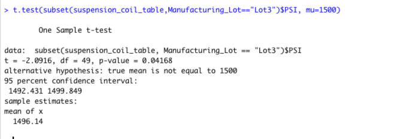

## Linear Regression to Predict MPG

### Which variables/coefficients provided a non-random amount of variance to the mpg values in the dataset?

According to our results, 

vehicle length, ground_clearance  (as well as intercept) are statistically unlikely to provide random amounts of variance to the linear model. 

###Is the slope of the linear model considered to be zero? Why or why not?

The p-value of our linear regression analysis is 5.35 x 10-11 which is much smaller than our assumed significance level of 0.05. Therefore, we can state that there is sufficient evidence to reject our null hypothesis, which means that the slope of our linear model is not zero.

### Does this linear model predict mpg of MechaCar prototypes effectively? Why or why not?

From the results the r-squared value is 0.71 which means there is a strong positive correlation between our variables. Therefore, we anticipate that the linear model will effectively predict mpg of MechaCar prototypes.

## Summary Statistics on Suspension Coils

As per total_summary statistics for all manufacturing lots,

The variance of the suspension coils for all manufacturing lots is 62.29 which does not exceed 100 pounds per square inch as per design specifications so we can conclude that current manufacturing data for all lots meet the design specification.

As per lot_summary statistics for each of the lots,

The variance of the suspension coils for Lot1 is 0.98 which is lot less than 100  so we can cocnclude that current manufacturing data for lot1 meets the design specification.

The variance of the suspension coils for Lot2 is 7.47 which is also lot less than 100  so we can cocnclude that current manufacturing data for lot2 meets the design specification.

The variance of the suspension coils for Lot3 is 170.3 which is more than 100  so we can cocnclude that current manufacturing data for lot3 does not meet the design specification.

## T-Tests on Suspension Coils

As can be seen in, 

assuming the significance level was the common 0.05 percent, p-value(0.06) is above the significance level. Therefore, we do not have sufficient evidence to reject the null hypothesis. So, we would state that PSI for all manufacturing lots and population mean are statistically similar.

Looking at the results for Lot1, 

assuming the significance level was same 0.05 percent, p-value of 1 is above the significance level. Therefore, we do not have sufficient evidence to reject the null hypothesis. So, we would state that PSI for manufacturing lot Lot1 and population mean are statistically similar.

Looking at the results for Lot2, 

assuming the significance level was same 0.05 percent, p-value of 0.61 is above the significance level. Therefore, we do not have sufficient evidence to reject the null hypothesis. So, we would state that PSI for manufacturing lot Lot2 and population mean are statistically similar.

Looking at the results for Lot3, 

assuming the significance level was same 0.05 percent, p-value of 0.04 is below the significance level. Therefore, we have sufficient evidence to reject the null hypothesis. So, we would state that PSI for manufacturing lot Lot3 and population mean are statistically different.

## Study Design: MechaCar vs Competition

In order to quantify how MechaCar performs against competition, a paired t-test seems appropriate to compare samples from different populations and  observations in one dataset can be paired with observations in another. Statistical test is performed to determine if there is a  statistical difference between the distribution means from two samples and test null hypothesis.

### What metric or metrics are you going to test?
I would be testing mpg & vehicle\_weight where in mpg is a dependent variable & vehicle\_weight is independent variable.

### What is the null hypothesis or alternative hypothesis?

Null hypothesis, the difference between the paired observations is equal to zero and alternate hypothesis is the difference between paired observations is not equal to zero.

### What statistical test would you use to test the hypothesis? And why?
I would use a pair t-test to compare if there is a statistical difference in overall mpg for same vehicle_weight between MechaCar and oter manufactueres.

### What data is needed to run the statistical test?
Sampled data from different populations(MechaCar & other manufacturers)